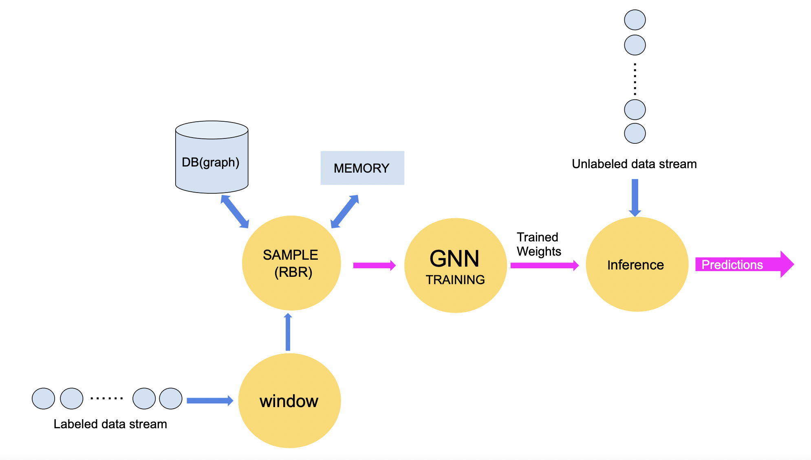
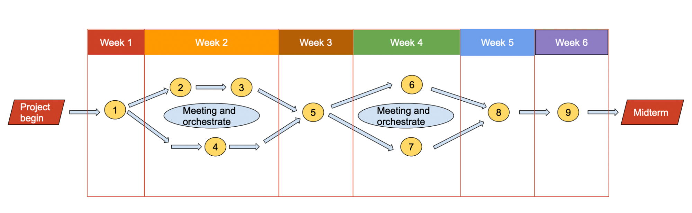

## Design Document

### Problem statement

- What is the problem that this project is going to address? 

  We are exploring the problem of online GNN training on a graph stream with limited memory. Specifically, we have to handle the “catastrophic forgetting” problem which is a major problem in online GNN training. Thus, we need to implement an efficient sampling technique.

- Why is it an important problem? 

  In the real world GNN models have to constantly be updated with the arrival of new data. For example, new users in a social network/recommender system, new medical data, etc. Secondly, retraining on the entire new graph each time we receive new data is inefficient and costly, while only training on new data will cause “catastrophic forgetting”. Finally, in many applications we have limited access to memory and thus sampling the graph stream is necessary.

- Who will benefit when the problem is solved?

  Graph data has become ubiquitous since it can model many real-word problems and graph neural networks are the universal tool for handling this data. Researchers, small companies/start-ups as well as big companies will benefit. 

  Online training GNN’s can result in less expensive training, and requires fewer resources (memory, CPU, GPU) from which companies will greatly benefit. Specifically, independent researchers and small companies have access to limited memory and thus retraining GNN’s with limited memory is necessary.

### Proposed solution

**NOTE**: The yellow circles depict flink operators.

- What is the basic approach, method, idea or tool that’s being suggested to solve the problem? 

  Our approach will be to implement a streaming system using Flink to consume a label graph data flow and interact with PyTorch to retrain the GNN. In order to handle the “catastrophic forgetting” problem we have to design an algorithm that samples training data from both the new data and the graph stored in disk.

  We will use Java Flink to handle the stream and perform stream sampling and batching. This data is sent downstream to the graph training Java Flink operator. We plan to limit the number of workers in this operator to one, such that it produces only one set of trained weights. We can look into more complicated distributed training setup as a stretch goal for the project. The  Graph training operator invokes an RPC Call to a GRPC train server written in Python. This train server recieves the batched and preprocessed data as RPC parameters. We use Pytorch / Tensorflow for this training. On conclusion, the train server returns the set of trained weights to the parent operator, which then publishes the weights to subscribed scalable inference operator downstream.
  
  As provided in the project description, we can use the code in online GNN learning [repo](https://github.com/MassimoPerini/online-gnn-learning). We do not need to alter the model code.

- Try to be as specific as possible and mention concrete tools / programming languages / frameworks.

  For the training pipeline we plan to use Python and Pytorch for the implementation. We plan to do the serving of the inference models with production grade tools like Pytorch Serving. For the streaming we are going to use Flink and for storing the graph we may use a graph database. We also plan to use GRPC for intercommunication between Python train server and flink training node. Finally, we plan to use Kafka for distributing the trained weights among the consumers responsible for hosting the inference servers.

  For starters, we plan to build the setup on one local machine. Hence we can quite easily use local IPC techniques like tempfiles and FIFO pipes to mimick GRPC.

### Expectations

- What exactly are the expected effects of the proposed solution? (e.g. a more efficient implementation or a more flexible API.) 

  The major contribution would be a more memory-efficient and computation-efficient implementation for Online Learning of GNNs. Compared with the RBR algorithm presented in the paper we want to achieve similar accuracy while having a memory size limit.

- Are there any alternatives you considered? 

  Regularization-based methods could be also considered, which does not require sampling the previously visited nodes. But it could only reduce the memory size requirement, and do not necessarily bring faster computation. It is very likely to decrease the performance.

  Meta-learning based sampling could be also useful to improve the continual learning performance. But this could improve the memory size and computation cost.

### Experimental plan

- What kind of measurements, simulations, and experiments are you planning to run in order to verify your hypotheses? 

  The metrics of interest are latency, accuracy and memory consumption.

  (Throughput will not be a metric of interest for our project at least as a primary goal, but a stretch goal can be to maximize    throughput if that’s needed.)

  We are going to experiment with different sample sizes, sampling algorithms, window sizes (i.e. after how many graph changes do we perform a training step) and other possible hyperparameters of our streaming system which are to be determined.

- What datasets are you planning to use?

  We plan to use the same datasets used in the base ii.e. PubMed, Arxiv and Bitcoin.

- Where will you deploy your experiments and what tools will you use to collect measurements? 

  Everything is going to be deployed and tested in a single (local) machine.

- How will the collected measurements confirm (or deny) the hypotheses? 

  For the GNN training we have the following alternatives:
  
  1. Retraining the network from scratch:
    - Upper bound in accuracy
    - Lower bound in efficiency of memory size and training cost
  2. Training only on the new nodes (“catastrophic forgetting”):
    - Lower bound in accuracy
    - Upper bound in efficiency of memory size and training cost
  3. RBR algorithm (presented in the paper):
    - Accuracy lower than baseline 1 and higher than baseline 2
    - Memory size and training cost lower than baseline 2 and higher than baseline 1
  
  Latency (end-to-end):
  we are going to measure the time it takes to update/retrain our model from the time we ingest new data.
  The algorithms presented in the paper (RBR and PBR) achieve seconds of latency  (~1-10 secs). Our goal is to achieve
  comparable performance although we expect to be slower since we are going to store data in disk as well as in memory.

  Our hypothesis is that with limited memory size we can still perform GNN online training while maintaining comparable accuracy with the RBR algorithm presented in the paper.
  
- What additional equipment or other resources will be needed?

  If needed, we can use GPU-equipped machines on Chameleon: https://www.chameleoncloud.org/ or SCC

### Success indicators

- What will be the outcome of the work? 

  Basic: A GNN online training method which can reduce the memory size requirement while staying within acceptable accuracy and latency ranges. A practical deployment method implemented with Pytorch/TensorFlow.

  Stretch Goal: Figure out an efficient way for priority based sampling, handle scalability issues, and prepare a submittable conference draft.

- What are the intermediate milestones? 

    1. Build the code base and run the baseline experiments. Get the result aligned with the paper. (week 1) 
    2. Implement the RBR algorithm with reservoir sampling in Python. Fake a data stream and keep everything in memory but train only on a sampled subset of data (proof of concept) (week 2-3)
    3. Do a (limited) experimental evaluation of this approach. (week 2-3)
    4. Integrate Flink with Python/Pytorch and TorchServe (week 2-3)
    5. Identify bottlenecks, add tests, and do an experimental evaluation of the application (week 4)
    6. Demo (week 4-5). Get feedback from the professor and discuss next steps.
    7. Presentation (week 4-5)
    8. Publish repo - write a comprehensive README file that explains how our solution works/ how one can use it/ future directions etc. (week 4-5)
    9. Improvements on the algorithms, scalability, etc. (discussion with the professor)

- What are the measures for success? (E.g. “faster”, “smaller”, “more available”.) 

  Mainly we want to achieve comparable accuracy to other online GNN training methods (i.e. the algorithms implemented in the paper) while limiting our memory consumption (GBs).

- How will we know to declare the project a success?

  Designing a reasonable sampling algorithm and implementing an efficient (in terms of memory consumption, latency) streaming system for online training of GNN’s.

### Task assignment

- How are you planning to break down the project into tasks and how are you going to assign those tasks to team members? 

  The final assignment could be changed dynamically according to the workload of each part and probably smaller tasks will arise as the project progresses. The initial high-level assignment will be the following two sub-teams:

  GNN training / Machine Learning: Adrish, Aoming

  Flink / Streaming: Fang, Yuhang, Iasonas

- Which tasks can be developed individually and possibly in parallel? 

  Tasks correspond to different milestones. Milestones 2-3 can be implemented in parallel with task 4. Also, milestones 6 and 7 can be done in parallel.

- How do tasks depend on each other? 

  Add the process graph here.

- What are the strengths and weaknesses of each team member and how are you planning to complement each other to achieve your goals?

  Aoming: Experience with pytorch and continual learning

  Adrish: Experience with Graph Learning, software engineering, MLOps

  Iasonas: Experience with Java, software engineering, algorithms

  Fang: Experience with C++, PyTorch, Algorithms, few shot learning

  Yuhang: Experience with Python, software engineering

  (Weakness) Nobody has experience with Flink
