# Evaluation

In this section, we conduct a thorough evaluation of our system\'s
performance across a diverse range of configurations. By exploring
various input rates, reservoir sizes and sampling depths, we gain
valuable insights into how these parameters affect key performance
metrics such as latency, throughput, memory consumption, and I/O usage.
This comprehensive assessment enables us to identify optimal
configurations for different scenarios, understand trade-offs, and
ultimately optimize the overall efficiency and performance of the
system.

## Evaluation Settings

**Setup.** Apache Flink v1.16.1

Apple M1 chip with 16GB main memory and 8 cores with 3.2GHz

**Metrics**. In our experiments, we evaluate four crucial performance
aspects of the system: latency, throughput, memory usage, and I/O
activity. These metrics provide valuable insights into the overall
efficiency and effectiveness of the system under different conditions.

To measure end-to-end latency, we utilize a customized histogram metric
designed specifically to calculate the processing-time lag incurred
during the entire data processing pipeline. This metric allows us to
understand the responsiveness of the system and identify any potential
bottlenecks.

For throughput evaluation, we rely on Flink\'s default metric, which
quantifies the number of output records produced before reaching the
sink. This helps us assess the system\'s ability to handle and process
data at varying rates, providing insights into its overall processing
capacity.

Memory consumption is a critical aspect of system performance, and we
measure it using two separate categories. The task manager\'s heap usage
is allocated for executing operators and user code, giving us insights
into the system\'s efficiency in managing memory resources for various
tasks. Off-heap usage is dedicated exclusively to running operators,
allowing us to analyze the memory requirements of these specific
components.

I/O behavior is assessed using iostat, a tool that monitors and records
the amount of data transferred, measured in KB, per tick. For arm64, 1
tick is 24MHz, approximately 41ns. This evaluation provides information
on the system\'s I/O efficiency and potential limitations.

While conducting these measurements, we take precautionary steps to
ensure the accuracy of our results. We disable the chaining between
operators and set parallelism to one, allowing us to better understand
the impact of each component on the system\'s overall performance.

**Configurations Parameters.**

Window size

Number of Neighbors

Reservoir Size(Maximum number of root nodes)

Computation Graph Depth(Sampling layers/depth)

Disablechaning

Disable RocksDB's memtable and LRUCache

**Data.** PubMed dataset (https://paperswithcode.com/dataset/pubmed)

\~20000 scientific publications

Each publication is classified into 1 of 3 classes

Each publication described by a TF/IDF weighted word vector

\~45000 links

**Structure.** Our evaluation process is broken down into three distinct
parts to thoroughly assess the performance of the system. First, we
examine how the system performs under a variety of input rates,
evaluating its ability to process and handle different volumes of
incoming data. Second, we analyze the performance when using different
reservoir sizes, observing how the system copes with varying root nodes
capacities and the impact on its efficiency. Lastly, we investigate how
the system performs under different sampling depths, determining the
effect of various levels of data sampling on the overall performance.

To ensure the reliability and accuracy of our findings, we adopt a
rigorous approach by running five separate tests for each unique
configuration. Once all the tests are completed, we calculate the
average performance results, effectively minimizing any potential
discrepancies or biases and providing a more accurate representation of
the system\'s capabilities under different conditions.

## 1.Performance under various Input Rates

**Configuration.** We hold all parameters constant except for the input
rate. The fixed configuration settings are:

Window size: 10

Number of neighbors: 2

Reservoir size(Maximum Root Samples): 2

Computation Graph Depth(Sampling layers): 2

### 1. Latency

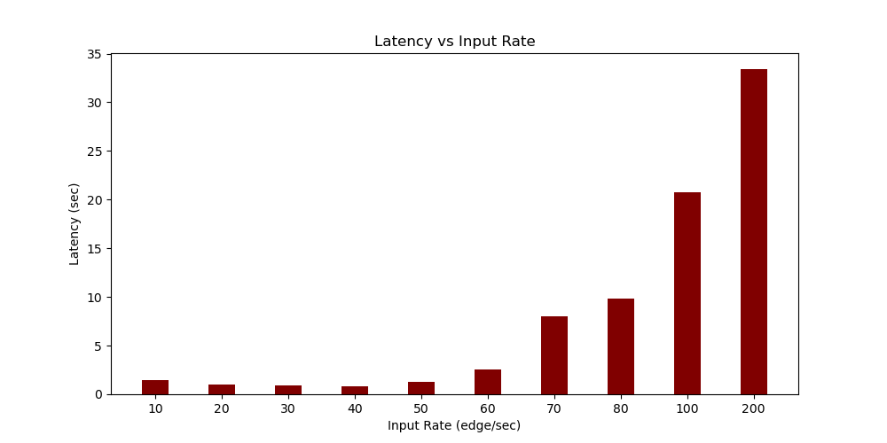

In general terms, end-to-end latency exhibits a monotonic increase as
the input rate rises. An interesting observation to consider is that the
lowest latency is not achieved when the input rate is merely 10. This
phenomenon can be attributed to the presence of a windowing operator
with a size of 10 within the system. As a result, when the input rate is
limited to 10 per second, the pipeline inevitably experiences a minimum
latency of 1 second.

Upon examining the system\'s performance with respect to input rate, we
find that the optimal performance is achieved at an input rate of
approximately 40. This observation highlights the importance of
carefully selecting an input rate that best suits the system\'s
requirements while maintaining optimal performance.

### 2. Throughput

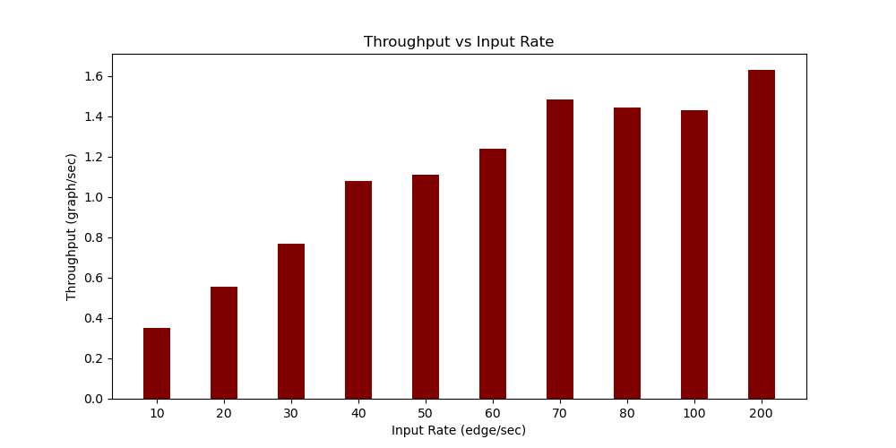

Throughput, measured in graphs per second (graph/sec), indicates the
number of computation graphs generated per second. These computation
graphs are partial graphs utilized by downstream machine learning
workers for training purposes. The overall trend of throughput closely
mirrors that of latency, with an increase in input rate generally
resulting in higher throughput.

Our system exhibits a sweet point at an input rate of approximately 60,
where it delivers a satisfactory throughput coupled with low latency.
Beyond this point, the growth of throughput does not continue at a rapid
pace. Instead, throughput tends to fluctuate around 1.5 graph/sec,
signifying that there are inherent limitations to the system\'s ability
to indefinitely increase throughput as the input rate continues to rise.
This observation underscores the importance of identifying an
appropriate balance between input rate, throughput, and latency for
optimal system performance.

### 3. Memory Consumption

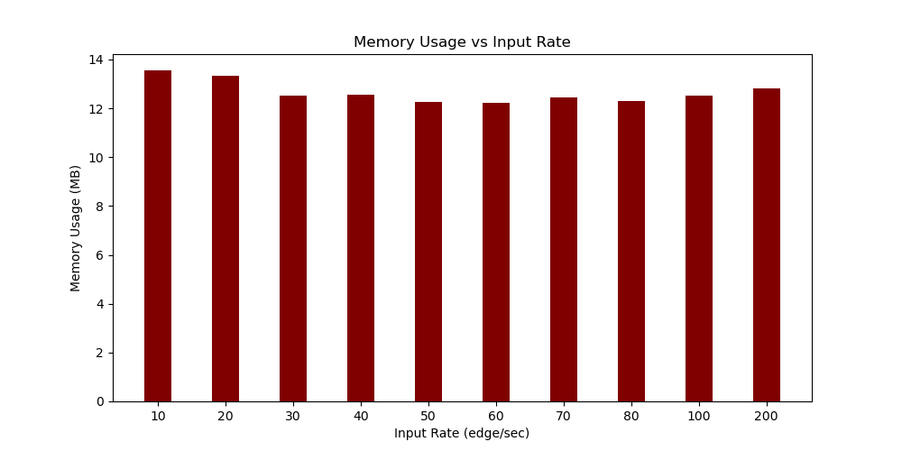

The memory consumption associated with running applications of operators
remains relatively stable, ranging between 12 and 14 units, even as the
input rate increases. This observation suggests that the system
effectively manages memory resources, maintaining consistent memory
usage levels for the operators despite fluctuations in the input rate.
This stable memory consumption contributes to the overall efficiency and
performance of the system under varying conditions.

### 4. I/O Behavior

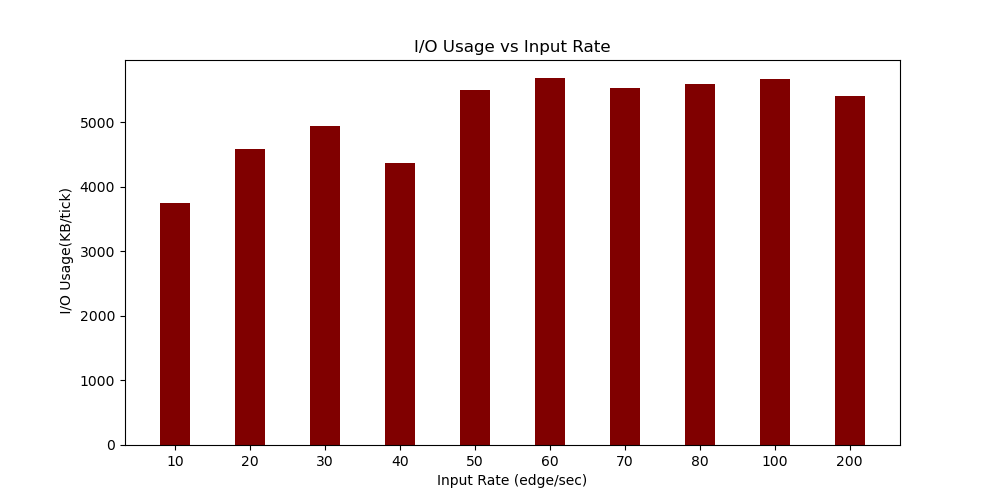

The unit KB/tick here means how much KB data is being transferred
between memory and disk per tick.

The overall trend observed in I/O usage indicates that it increases in
tandem with the growth of the input rate. This suggests that as more
data is introduced into the system, the I/O activity correspondingly
escalates to handle the higher volume of data being processed and
transferred. However, once the input rate reaches the threshold of 60,
the I/O usage plateaus and stabilizes within a range of approximately
5000 to 6000. This observation suggests that the system may have reached
its maximum I/O capacity or efficiency level under these conditions. It
is essential to consider this limitation when planning for system
scalability or optimizing performance, as further increasing the input
rate beyond this point may not lead to a proportional increase in I/O
usage or overall throughput, which is indeed the case of throughput
analysis.

## 2.Performance under various Reservoir sizes

**Configuration.** We hold all parameters constant except for the input
rate. The fixed configuration settings are:

Window size: 10

Number of neighbors: 2

Input Rate: 40

Sampling layers: 2

### 1. Latency

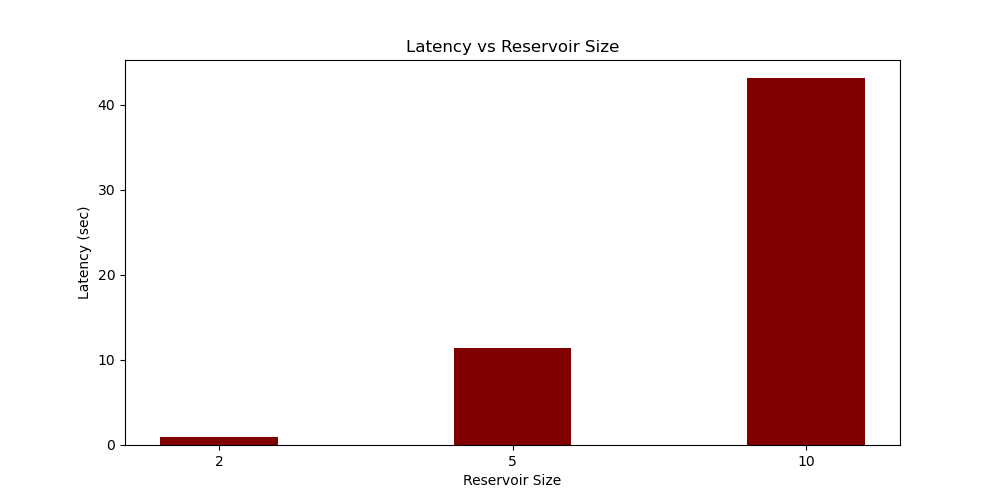
The graph illustrates that as the reservoir size increases, latency consistently
rises. The reservoir size is indicative of the total number of root
nodes in the partial graph for downstream worker. Consequently, when the
reservoir size expands, the entire graph grows, incorporating a larger
number of nodes. In addition to the increase in nodes, the expanded
graph also impacts the performance of successor operators, such as
MapToComputationGraph and MapToRow. These operators require more time to
complete their tasks due to the increased complexity and size of the
graph. This, in turn, results in a substantially higher end-to-end
latency. Understanding this relationship between reservoir size and
latency is crucial for balancing system performance and scalability,
since this could be the largest potential bottleneck of our system, and
optimizing the system\'s overall efficiency.

### 

### 2. Throughput

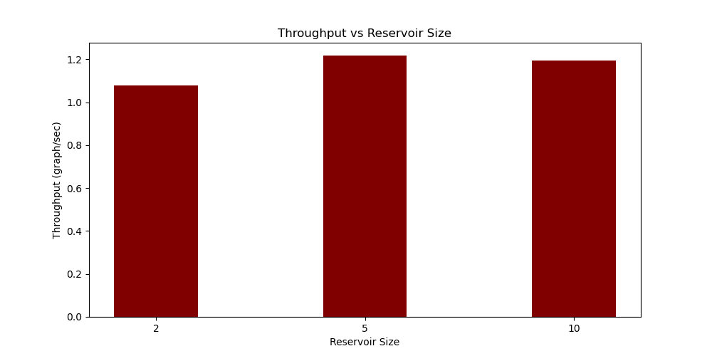
As the reservoir size increases, the throughput experiences a slight initial increase,
followed by a period of stabilization and, eventually, a decrease. This
pattern suggests that while enlarging the reservoir size may initially
improve the system\'s ability to handle and process data, there is a
point beyond which the throughput no longer benefits from this increase.
In fact, further enlargement of the reservoir size may even lead to a
reduction in throughput. Plus this will introduce a rather high latency.
But it is a trade-off, the larger the final graph is, the more training
data the downstream worker can utilize.

### 3. Memory Consumption

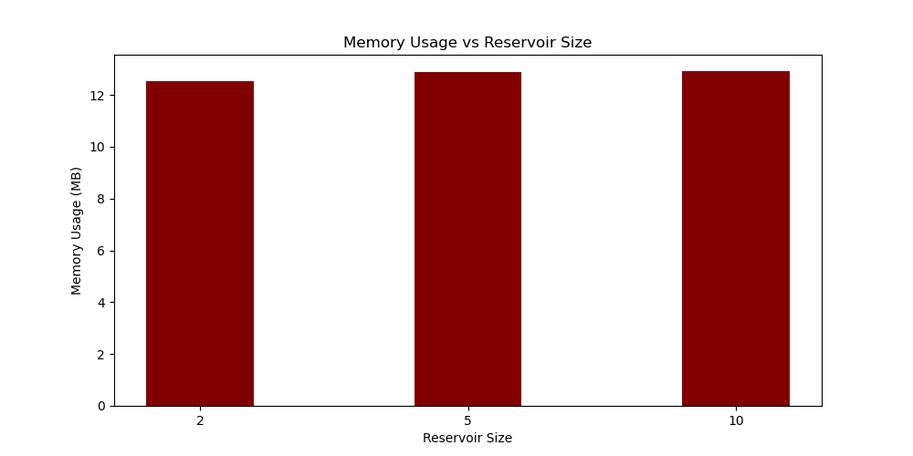

The memory consumption associated with running applications of operators
remains relatively stable, even as the reservoir size increases. This
observation suggests that the system effectively manages memory
resources, maintaining consistent memory usage levels for the operators
despite changes in reservoir size. This stable memory consumption
contributes to the overall efficiency and performance of the system
under varying conditions, demonstrating its ability to adapt to
different scenarios without a significant impact on memory usage. This
efficient memory management is an important aspect of system
optimization, ensuring that resources are allocated appropriately and
not strained due to fluctuations in reservoir size.

### 4. I/O Behavior

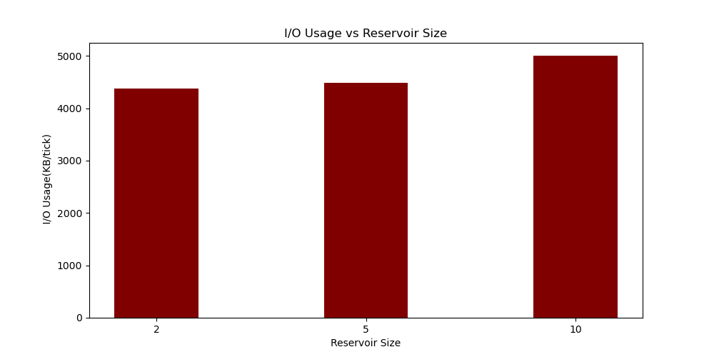

As the reservoir size increases, I/O usage exhibits a slight upward
trend. This implies that a larger reservoir size leads to a moderate
increase in data processing and transfer activity within the system.

## 3.Performance under various Sampling depths

**Configuration.** We hold all parameters constant except for the input
rate. The fixed configuration settings are:

Window size: 10

Number of neighbors: 2

Input Rate: 40

Reservoir Size: 2

### 1. Latency

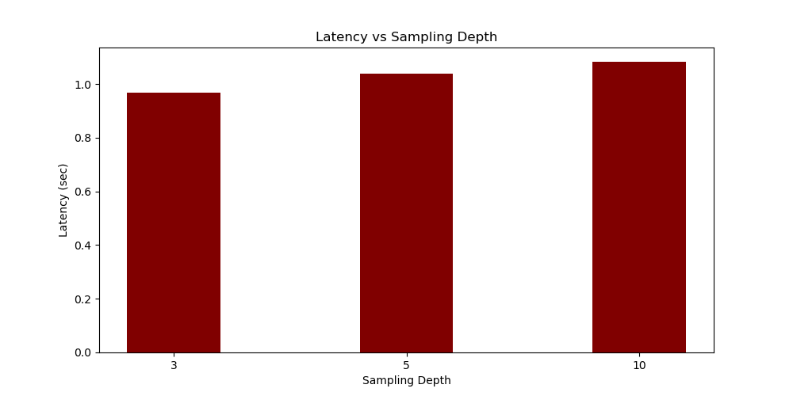
As the sampling depth increases, there is a slight increase in end-to-end latency. This
suggests that a higher sampling depth, which corresponds to a more
detailed and extensive analysis of data, leads to a marginally longer
processing time within the pipeline. Compared to increasing reservoir
size, expanding the sampling layers might be a more effective approach
for constructing graphs for downstream worker. This is because
increasing sampling layers results in only a slight increase in
end-to-end latency, whereas enlarging reservoir size can lead to
significantly higher latency.

### 2. Throughput

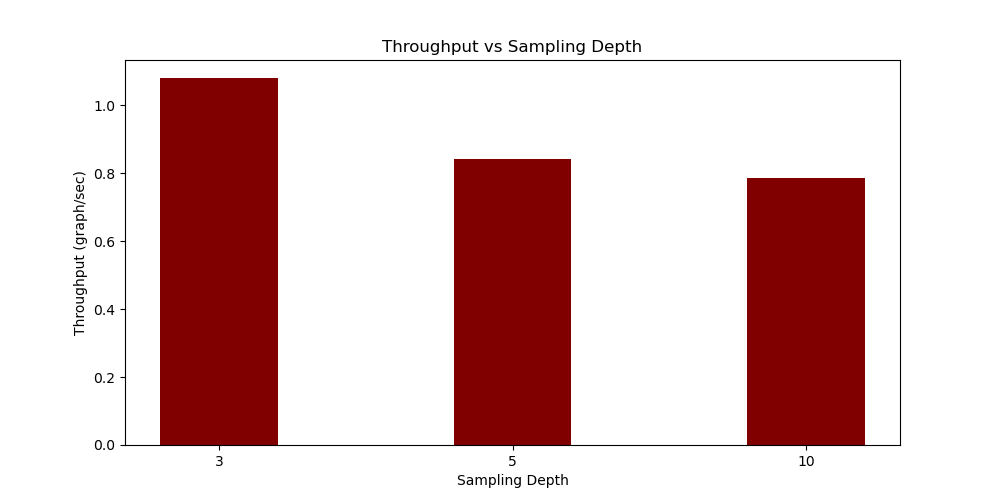

As the sampling depth increases, the system experiences a decrease in
throughput. This suggests that a higher sampling depth, which involves
more extensive graph constructing, leads to a reduced rate at which the
system can process and handle data. It is crucial to consider this
trade-off between sampling depth and throughput when optimizing system
performance.

### 3. Memory Consumption

Memory consumption remains relatively stable at a level of approximately
12MB, regardless of changes in sampling depth, this is also the case
when evaluating reservoir size and input rate.

### 4. I/O Behavior

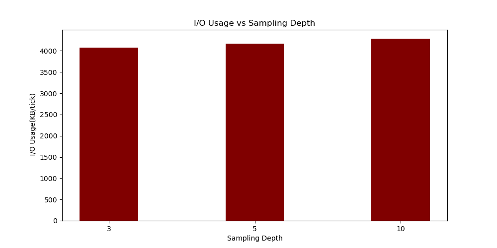

As the sampling depth increases, I/O usage experiences a very subtle
increase, but overly lies in somewhere between 4000 and 4500. This
implies that a higher sampling depth, which involves more extensive data
analysis, leads to a slight rise in data processing and transfer
activity within the system.
